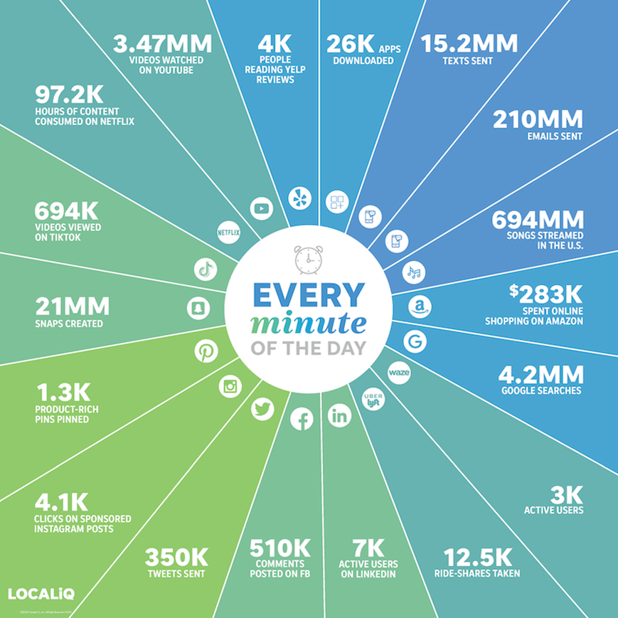
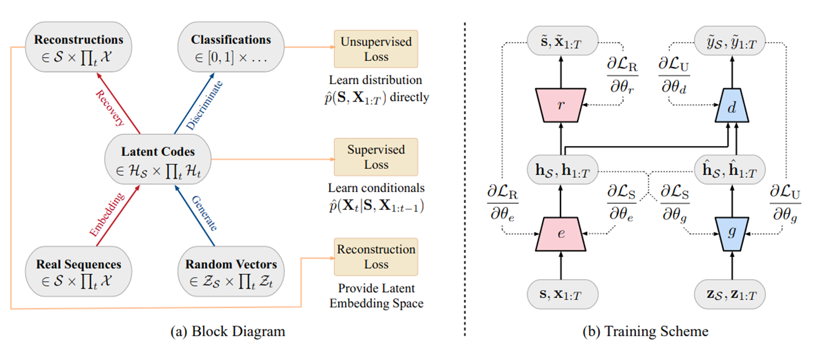
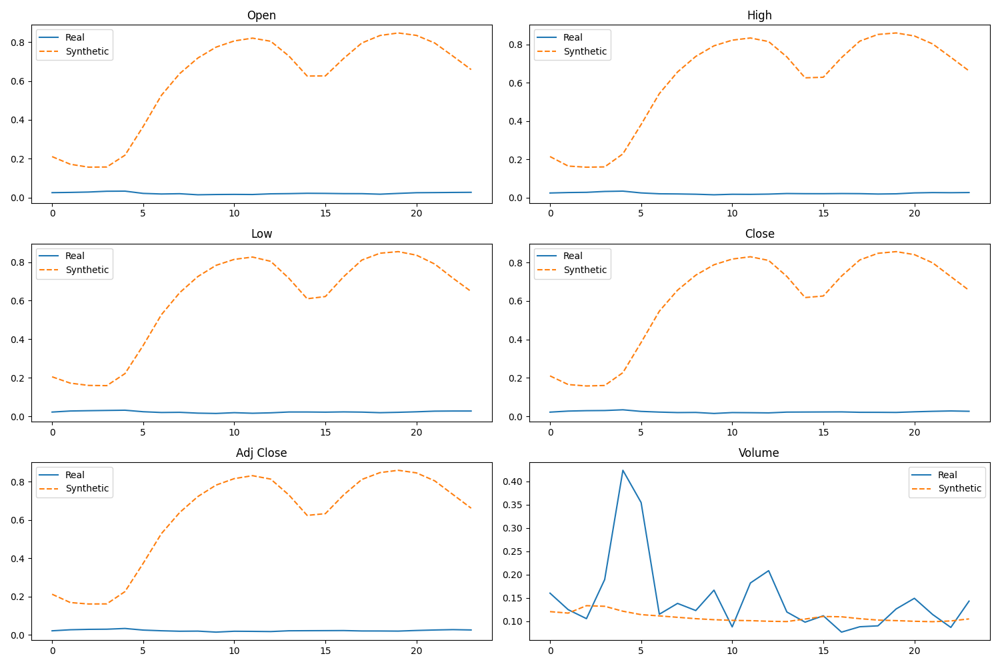
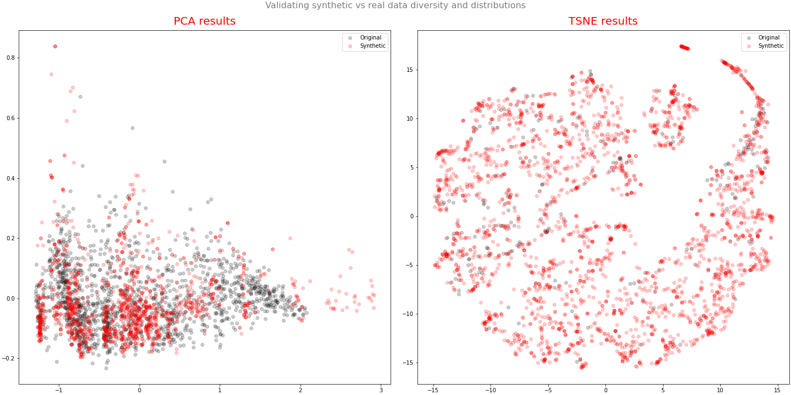
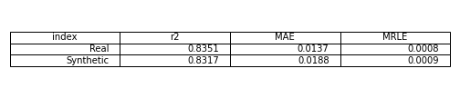

# Term Project: Synthetic Data Generation using GAN 

## Why synthetic data?

In 2020, the amount of data on the internet hit 40 zetabytes. A zetabyte is about a trillion gigabytes. 

So why we need synthetic data?

There are many good reasons behind it. Here are some important ones:
- Cost of preparing and labeling data
- Prototype Development
- Edge-case Simulation
- Data Privacy

## TimeGAN:

- TimeGAN is proposed in 2019.
- It is different from other GAN architecture. It has 4 components: 
  - **Generator**
  - **Discriminator**
  - **Recovery**
  - **Embedder**
  
- It introduced the concept of supervised loss and embedding network. 
  - **Supervised loss**: The model is capturing the time conditional distribution by using the original data as a supervision. 
  - **Embedding network**: It is reducing the adversarial learning space dimensionality.
  
- It can generate both static (dimensions) and sequential data (TS) at the same time.
- Less sensitive to hyperparameters.
- The training process is more stable.

With respect to the loss functions:
- **Reconstruction loss**:  Compares the reconstruction of the encoded data compared to the original data.
- **Supervised loss**: Measures the quality of generator approximation of the next time step in the latent space.
- **Unsupervised loss**: This is the familiar min-max game. It shows the relation of the generator and discriminator networks.

There are three training phases:
- **Phase I**: Training the Autoencoder
- **Phase II**: Training the supervisor to capture the temporal behavior.
- **Phase III**: The combined training of generator, discriminator and embedder. We try to minimize all three loss functions in this phase. Based on the paper's suggestion the generator and embedder are trained twice the discriminator in this phase.

## Result:

I have ploted the Synthetic vs real data in two ways:
- for each variable I have plotted sample of the data
  

  

    
- Reduce the dimension using PCA and TSNE and plot the PCA and TSNE in 2 dimension to compare the data

  
  

I also trained the model on real data then test it on real data and train another model on synthesized data 
and test it on real data and compared the metrics.

The synthetic data is looking good after 20K steps. The initial plan was to train for 
50K steps but for some reason it is failing. I run out of time to fix that.

## References:
- https://www.smartinsights.com/internet-marketing-statistics/happens-online-60-seconds/
- https://papers.nips.cc/paper/2014/file/5ca3e9b122f61f8f06494c97b1afccf3-Paper.pdf
- https://papers.nips.cc/paper/2019/file/c9efe5f26cd17ba6216bbe2a7d26d490-Paper.pdf

