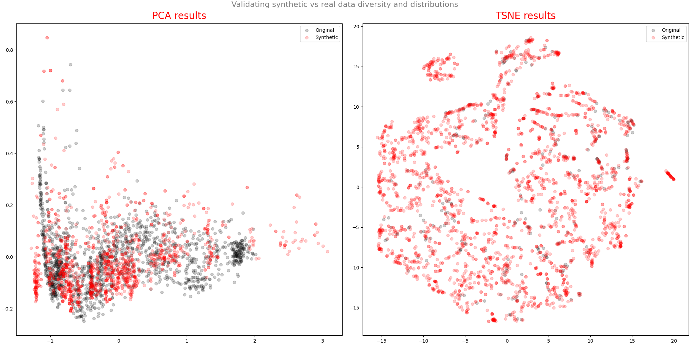

# Term Project: Synthetic Data Generation using GAN 

## Why synthetic data?

In 2020, the amount of data on the internet hit 40 zetabytes. A zetabyte is about a trillion gigabytes. 

So why we need synthetic data?

There are many good reasons behind it. Here are some important ones:
- Cost of preparing and labeling data
- Prototype Development
- Edge-case Simulation
- Data Privacy

## TimeGAN:

- TimeGAN is proposed in 2019.
- It is different from other GAN architecture. It has 4 components: 
  - **Generator**
  - **Discriminator**
  - **Recovery**
  - **Embedder**
  
- It introduced the concept of supervised loss and embedding network. 
  - **Supervised loss**: The model is capturing the time conditional distribution by using the original data as a supervision. 
  - **Embedding network**: It is reducing the adversarial learning space dimensionality.
  
- It can generate both static (dimensions) and sequential data (TS) at the same time.
- Less sensitive to hyperparameters.
- The training process is more stable.

With respect to the loss functions:
- **Reconstruction loss**:  Compares the reconstruction of the encoded data compared to the original data.
- **Supervised loss**: Measures the quality of generator approximation of the next time step in the latent space.
- **Unsupervised loss**: This is the familiar min-max game. It shows the relation of the generator and discriminator networks.

There are three training phases:
- **Phase I**: Training the Autoencoder
- **Phase II**: Training the supervisor to capture the temporal behavior.
- **Phase III**: The combined training of generator, discriminator and embedder. We try to minimize all three loss functions in this phase. Based on the paper's suggestion the generator and embedder are trained twice the discriminator in this phase.

## Result:

I have experimented with 10K, 20K, and 50K then plotted the Synthetic vs real data in two ways:
for each variable I have plotted sample of the data and then Reduce the dimension using PCA and TSNE and plot the PCA 
and TSNE in 2 dimension to compare the data.

Finally, two regressor were trained: 
- one on real data 
- Another one on synthesized data 

Then both are tested on real data, and the results are compared.

### The runtime:
The training is computationally intensive. Especially in the phase III where 
the generator and embedder are trained twice the discriminator.

I am running it on an ThinkPad with 10th Gen i7 CPU and 16GB memory. I do not have 
NVIDIA GPU. Here are runtime stats:

- For 10K:
  - Phase I (Embedding network): ~15m
  - Phase II (Supervisor network): ~15m
  - Phase III (Joint network training): ~2H:30m 
- For 20K:
  - Phase I (Embedding network): ~30m
  - Phase II (Supervisor network): ~30m
  - Phase III (Joint network training): ~3H:30m
- For 50K:
  - Phase I (Embedding network): ~7H
  - Phase II (Supervisor network): ~7H
  - Phase III (Joint network training): ~21H
  
As you can see the runtime increases significantly, but you will see 
that we are not benefited much from the extra time.

### Data Comparison:

After training for 10K steps here are the variable comparison and the PCA and TSNE.

 

The regressor is showing a promising results.

After training for 20K steps here are the variable comparison and the PCA and TSNE.

 

The regressor is showing a promising results.

It is evident that after almost spending twice the time training the model we didn't gain much in terms of predictive 
power. However, The PCA and TSNE graphs are showing a tighter fit. 

Finally, I trained the TimeGAN for 50K steps here are the variable comparison and the PCA and TSNE.

 

The regressor is showing a promising results.

I can fairly conclude that it wasn't worth the time spent. Even we lost a bit
of the prediction power probably due to the noise added.

## References:
- https://www.smartinsights.com/internet-marketing-statistics/happens-online-60-seconds/
- https://papers.nips.cc/paper/2014/file/5ca3e9b122f61f8f06494c97b1afccf3-Paper.pdf
- https://papers.nips.cc/paper/2019/file/c9efe5f26cd17ba6216bbe2a7d26d490-Paper.pdf

